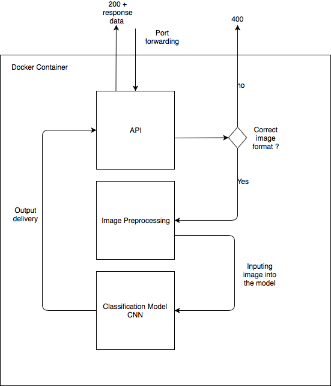

# Cat VS Dog AI
 [](https://www.python.org/)
## Overview
API server providing access to simple classification AI, differentiating class from dogs

This project is built to showcase a full AI implementation.
You can of course clone the repository to start with a 
barebone, production ready, classification model.

The model training was done on Google Colab

## Technology 
The project is build on the following frameworks and technologies:

##### For the model
* Keras 
* VGG-16 for transfer learning
* OpenCV for image preprocessing ::Pending::

##### For the production environment
* Flask
* Docker 


##  Model architecture
The model was build on top of the VGG-16 by freezing all of its weights. 
The input and output layers have of course been modified for our own business case.

```
Model: "sequential_1"
_________________________________________________________________
Layer (type)                 Output Shape              Param #   
=================================================================
conv2d_1 (Conv2D)            (None, 128, 128, 64)      1792      
_________________________________________________________________
max_pooling2d_1 (MaxPooling2 (None, 64, 64, 64)        0         
_________________________________________________________________
block1_conv2 (Conv2D)        (None, 64, 64, 64)        36928     
_________________________________________________________________
block1_pool (MaxPooling2D)   (None, 32, 32, 64)        0         
_________________________________________________________________
block2_conv1 (Conv2D)        (None, 32, 32, 128)       73856     
_________________________________________________________________
block2_conv2 (Conv2D)        (None, 32, 32, 128)       147584    
_________________________________________________________________
block2_pool (MaxPooling2D)   (None, 16, 16, 128)       0         
_________________________________________________________________
block3_conv1 (Conv2D)        (None, 16, 16, 256)       295168    
_________________________________________________________________
block3_conv2 (Conv2D)        (None, 16, 16, 256)       590080    
_________________________________________________________________
block3_conv3 (Conv2D)        (None, 16, 16, 256)       590080    
_________________________________________________________________
block3_pool (MaxPooling2D)   (None, 8, 8, 256)         0         
_________________________________________________________________
block4_conv1 (Conv2D)        (None, 8, 8, 512)         1180160   
_________________________________________________________________
block4_conv2 (Conv2D)        (None, 8, 8, 512)         2359808   
_________________________________________________________________
block4_conv3 (Conv2D)        (None, 8, 8, 512)         2359808   
_________________________________________________________________
block4_pool (MaxPooling2D)   (None, 4, 4, 512)         0         
_________________________________________________________________
block5_conv1 (Conv2D)        (None, 4, 4, 512)         2359808   
_________________________________________________________________
block5_conv2 (Conv2D)        (None, 4, 4, 512)         2359808   
_________________________________________________________________
block5_conv3 (Conv2D)        (None, 4, 4, 512)         2359808   
_________________________________________________________________
block5_pool (MaxPooling2D)   (None, 2, 2, 512)         0         
_________________________________________________________________
flatten_2 (Flatten)          (None, 2048)              0         
_________________________________________________________________
dense_3 (Dense)              (None, 256)               524544    
_________________________________________________________________
dropout_2 (Dropout)          (None, 256)               0         
_________________________________________________________________
dense_4 (Dense)              (None, 2)                 514       
```
 
## Routes
The API has two endpoints :

###### /ping [GET]
GET: single endpoint to check if server is still alive 

###### /bot [POST]
Expecting FormData object
Header : 
```javascript
 {
	"Content-Type": "multipart/form-data"
}

```

Body :
```javascript
// FormData
('file', { uri: img_uri, name: 'image.jpg', type: 'image/jpeg' })

```

## To kick start the server :
Install all dependencies, make sure that you have python 3.7 installed and docker running on your computer.

```bash
docker built --t cat_vs_dog .
```

Then once built

```bash
sudo PORT=5000 docker run -p 5000:5000 -e PORT  -t cat_dog:latest
```

If when calling on ‘localhost:5000/ping you’  get  the following message
‘server running’

Then your server is actually set and ready to do the job
